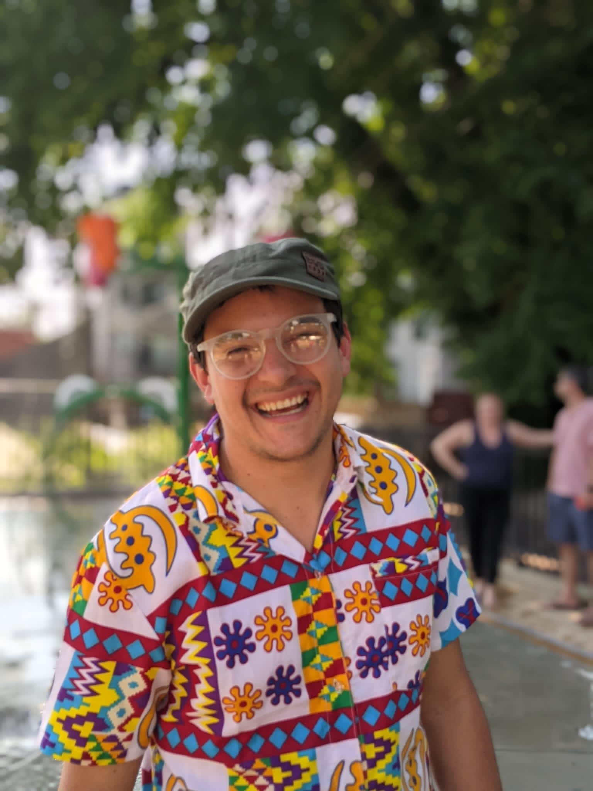

Hello! My name is Yvan David Hernandez-Charpak, a french-colombian scientist, adventurer, traveler and person.  I like hiking, traveling, working and exploring new experiences. I am curently a PhD candidate in Sustainability at the Rochester Institute of Technology.

This site will layout my work, my research and provide some (hopefully usefull) ressources. 

[My project](./projects) is to change the way you think about waste. Through **biochar**, we can consolidate the carbon present in our _organic_ waste (from our agriculture or food waste!). 

My [research](./research) contains the list of my academic publications, from my early 2020 undegraduate projects, up to my PhD articles and (soon!) dissertation! Briefly, I approach thematics like:
- Biochar characterization
- Biochar production
- Social Engineering
- Plastic biodegradation
- Plastic characterization
- Plastic film production
- Plastics in Agriculture
- Life Cycle Assessment (LCA) 
- Techno Economical Analysis (TEA) 

If you are interested in learning more about any of these concepts, I would be happy to have a conversation with you! Don't doubt connecting with me through my [LinkedIn](https://www.linkedin.com/in/ydhc/) or my [Twitter](https://twitter.com/YvanDavidHernan)

 
<!---
###Contains basic configuration to get you a site with:

#- Sample posts and [paginated blog index](./blog/).
##- Sample collection with Markdown and kramdown cheatsheets and [collection index](./cheatsheets).
##- Archive pages for posts grouped by year, category, and tag.
##- Demo page with the different Bootstrap components and how they look with the actual skin settings.
##- Sample 404 page.
##- Site search with Lunr.
#- Sample `_config` with minimal configuration. `primary` color is set to LightSkyBlue and `autothemer` is enabled. [Learn how to customize your site](https://dieghernan.github.io/chulapa/docs/03-theming).
#- Sample `algolia-search.yml` for using Algolia+GitHub Actions.
#- Sample files for extending the theme with your own scripts and css.

#On addition, `jekyll-sitemap` generates your sitemap on [./sitemap.xml](./sitemap.xml), and Chulapa generates an Atom feed on [./atom.xml](./atom.xml) and a RSS 2.0 feed on [./rss.xml](./rss.xml).

#[Configure as necessary](https://dieghernan.github.io/chulapa/docs/02-config) and replace sample content with your own.
--->